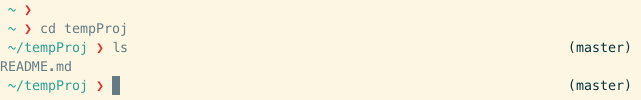
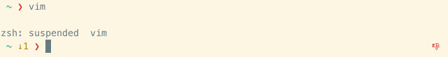

# Zsh-Prompto

Zsh-Prompto is a simple-and-sweet, lightweight-and-useful prompt for zsh users.

## Features:

* Current directory

* Name of git branch

* Non-zero command-exit indicator

* Number of background jobs


## Installation

* Clone the `zsh-prompto` repository:
    ```
    git clone https://github.com/manasthakur/zsh-prompto.git
    ```

* Symlink the code file:
    ```
    mkdir -p ~/.zsh; ln -sf <PATH TO zsh-prompto>/zsh-prompto.zsh ~/.zsh/zsh-prompto.zsh
    ```

* To update zsh-prompto, just pull the latest version:
    ```
    cd <PATH TO zsh-prompto>; git pull
    ```

Feel free to ping me for any queries/suggestions.

